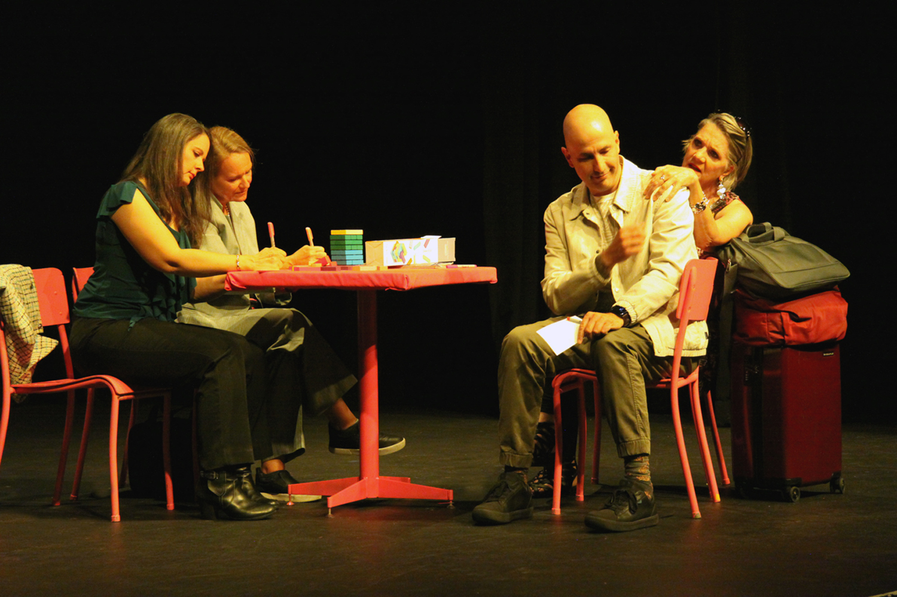
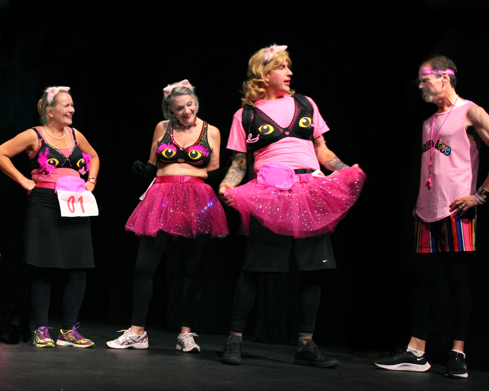
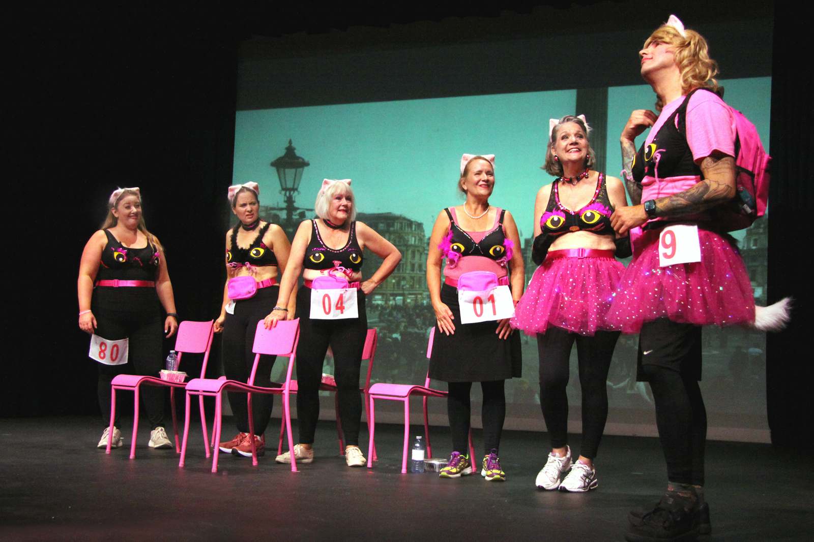
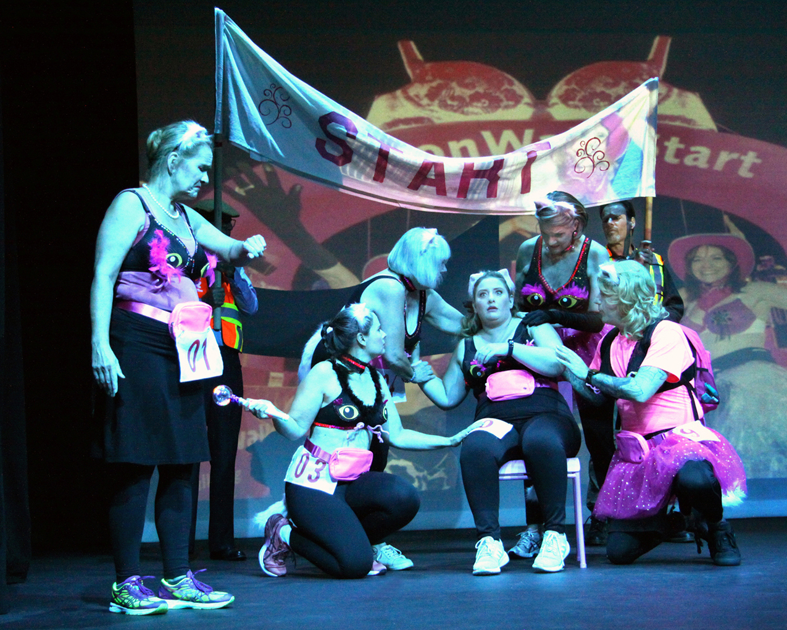
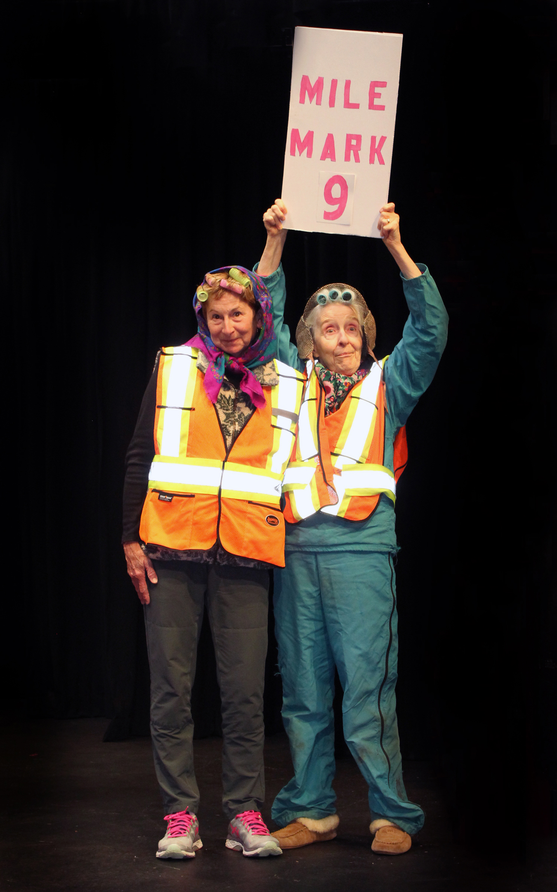
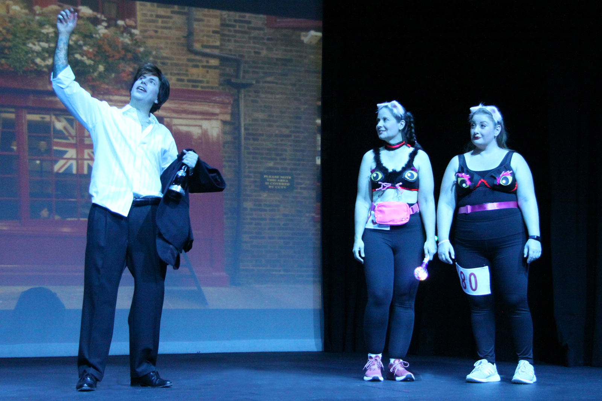
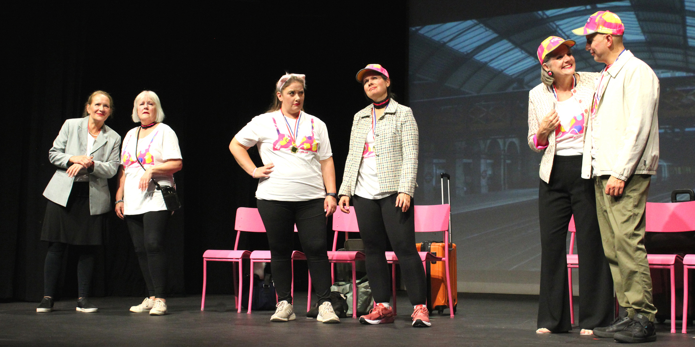

---
{
  id: "cheshire-cats",
  layout: '../../../layouts/Portfolio2.astro',
  scheme: "art",
  title: "Cheshire Cats",
  description: "I've never worn makeup like this before.",
  pubDate: '2024-10-02',
  updatedDate: '2025-10-02',
  heroImage: "bg.jpg",
	teaserImage: "bg.jpg",
	bgColor: "base",
}
---

  

  

  

  

  

  

  

<small>Photos: <a href="https://www.instagram.com/echoplayers/" target="_blank" ref="nofollow noopener">@echoplayers</a></small>

**Credit:** Andrew / The Handsome Drunk

Director Michael King was nice enough to cast me in another fun production. This time in a bit of a bigger role, as Andrew, willing to do what it takes to join his new girlfriend on an all girls trip to London.

I also had the pleasure of playing The Handsome Drunk, a fun character who gets to serenade a couple of ladies from the group as they make their way through London on a walk to raise money for charity. It was a little daunting to sing acapella in front of a live audience, but hey, he was drunk and handsome, so I hope also charming enough to pull it off. ;)
