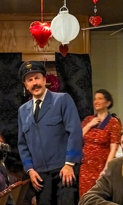
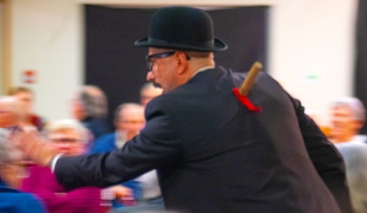

---
{
  id: "death-by-fatal-murder",
  layout: '../../../layouts/Portfolio2.astro',
  scheme: "art",
  title: "Death by Fatal Murder",
  description: "A farcical dinner theatre production.",
  pubDate: '2023-02-02',
  updatedDate: '2025-10-02',
  heroImage: "bg.jpg",
	teaserImage: "bg.jpg",
	bgColor: "light",
}
---

  

  

  

  

  

  

  

<small>Photos: <a href="https://www.instagram.com/echoplayers/" target="_blank" ref="nofollow noopener">@echoplayers</a></small>

**Credit:** All Three Brothers in the "Dooley Gang"

This experience brought me back to my love of performing. It was a dinner theatre performed surrounded by guests. It really brought back memories of my street performing days, where you have to play big and be entertaining in 360 degrees!

It was so much fun to be part of this production, and I loved every minute of it. The cast and crew were all fantastic, and the audience reactions were priceless. My only regret is that we only did 3 shows, and we didn't get to eat the amazing looking food!

I tested my range in this farce by playing all three of the Dooley brothers, who were all very different characters pretending to be someone they were not. This meant 4 different accents, and 3 silly costumes, 3 different moustach styles (yes it's real), and so many different ways to die. It was a blast!
