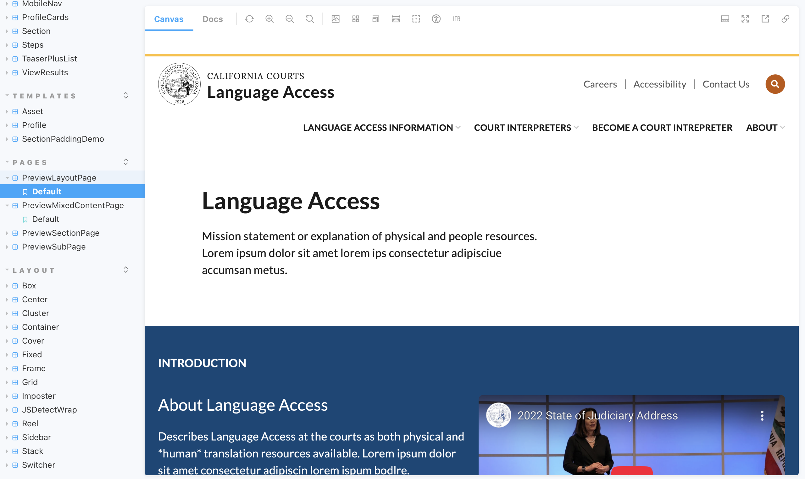

---
{
  id: "jcc-components",
  layout: '../../../layouts/Portfolio.astro',
  scheme: "tech",
  title: "JCC: Components",
  description: "Composable, algorithmic layouts.",
  pubDate: '2023-01-04',
  updatedDate: '2023-01-01',
  heroImage: "/../src/pages/portfolio/jcc-components/bg.png",
	teaserImage: "/../src/pages/portfolio/jcc-components/bg.png",
	bgColor: "dark",
}
---

  

  

  

  

  
About JCC

  _The Judicial Council of California is the largest judicial system in the US. Over the course of several years I had the opportunity to contribute to the development of the core platform that powers 50+ court websites and several other important legal resources for the people of California._

  _I worked with multiple stakeholders and as part of 2 development teams; the JCC internal dev team as well as a team from Chapter Three they hired to lead the architecting and development of the platform._

## Component Library

I set the standards for the architecitecture of this component library, based on principles of <a href="https://atomicdesign.bradfrost.com" target="_blank" ref="nofollow noopener">Atomic Design</a> and <a href="https://every-layout.dev/blog/algorithmic-design/" target="_blank" ref="nofollow noopener">Algorithmic Layout</a>. This enables a hyper efficient and light weight codebase of composable atomic structures. At the risk of stating the obvious, components should be composable, not just a collection of design chunks that don't necessarily play well together. I built the foundational components, then coached the front end team in the system and handed it off for them to expand and maintain as needed.

**The codebase may have changed since I left but the foundation should be there.*

#### Highlights from the robust documentation I wrote for the project
 - <a href="https://judicialcouncilofcalifornia.github.io/jcc_storybook/feature/COURTS-294--alerts-update/docs/?path=/docs/documentation-intro--default" target="_blank" rel="nofollow noopener">Storybook: Intro</a>
 - <a href="https://judicialcouncilofcalifornia.github.io/jcc_storybook/feature/COURTS-294--alerts-update/docs/?path=/docs/documentation-bestpractices--default" target="_blank" rel="nofollow noopener">Storybook: Best Practices</a>
 - <a href="https://judicialcouncilofcalifornia.github.io/jcc_storybook/feature/COURTS-294--alerts-update/docs/?path=/docs/documentation-cssbestpractices--default" target="_blank" rel="nofollow noopener">Storybook: CSS Best Practices</a>
 - <a href="https://judicialcouncilofcalifornia.github.io/jcc_storybook/feature/COURTS-294--alerts-update/docs/?path=/docs/documentation-templatesandlayout--default" target="_blank" rel="nofollow noopener">Storybook: Templates and Layout</a>

Please explore the full Storybook library for examples of all the components and the underlying Layout Primitives and Scheme that power them.

### From Storybook: Intro

This component library aims to provide versatile and modular components that allow Drupal Theme developers to build complex themes in a customizable yet reliable way.

We aim to avoid exceptions and workarounds, in favor of thoughtful systemization and design.

#### Layout System

This project uses a layout system for __composing__ complex and responsive layouts.

Each layout is "intrinsically responsive", meaning it will automatically adapt internally so content is visible and well spaced on any screen or context, __without the use of @media breakpoints__. It respects the space required by the content and works with the browser's natural behavior, rather than against it.

This approach allows for developers to create complex and dynamic layouts with a small set of reusable code. An entire layout system, 13 layout "primitives", in __under 250 lines of CSS__.

`layout-primitives.css`

For a deep dive into the approach, please see the "Rudiments" at https://every-layout.dev (free to read online).

#### Atomic Components

The 13 layout primitives are used to build up a library of "Atomic" Components.

Again, this gives us reusable parts that we can use to __compose__ more complex components. It uses a chemistry metaphor to illustrate and guide our planning;

Atoms come together to form Molecules come together to form Organisms.

To learn all about Atomic Design, see Brad Frost's great book <a href="https://atomicdesign.bradfrost.com" target="_blank" ref="nofollow noopener">Atomic Design</a> (free to read online).

#### Component Variants

Component templates are designed in a way that allows the layout and styling of its composition (sub-components) to be determined by one or more variant classes on the outermost container.

For example:

 - `.card`
 - `.card--media-left`
 - `.card--overlay`

A single template containing all the sub-components for media, heading, text, button, etc., is rendered in dramatically different ways based on the modifier class. We call each different presentation of the same template a "variant".

This is achieved by thoughtful use of modern CSS, the Layout System, and Atomic Components, making everything __small, modular and reusable__.

#### Scheme

At the `:root` of our CSS is a set of custom properties (aka: variables) that capture all the key values that define our <a href="https://every-layout.dev/rudiments/modular-scale" target="_blank" rel="nofollow noopener">modular scale</a>, color pallette, font families and more.

`scheme-default.css`

By replacing or altering the scheme CSS file to change the variable values, we can dramatically alter the look and feel of the entire component library.

#### Not Sassy

This library does not have the overhead of Sass/SCSS. It uses plain but __modern CSS__. Most of the benefits of SCSS are eliminated with the use of modern CSS and Atomic components. Individual component CSS files can be very small and well structured for maximum flexibility and maintainability. Atomic Design, by it's nature, gives us component reusability.
