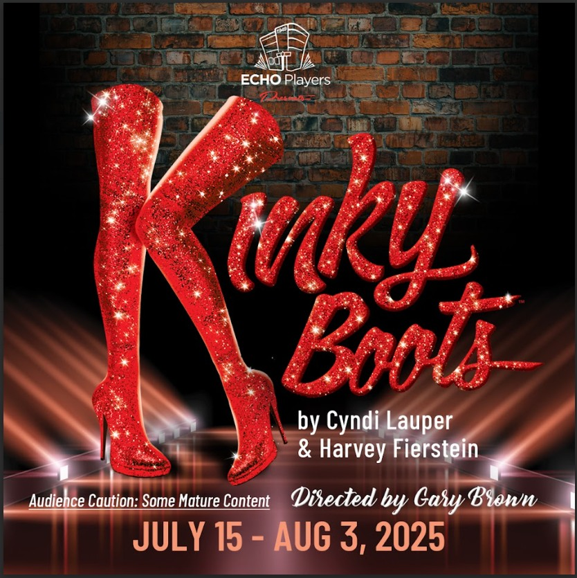

---
{
  id: "kinky-boots",
  layout: '../../../layouts/Portfolio2.astro',
  scheme: "art",
  title: "Kinky Boots",
  description: "Lighting Operator / Trainer",
  pubDate: '2025-08-01',
  updatedDate: '2025-10-01',
  heroImage: "castandcrew.jpg",
	teaserImage: "castandcrew.jpg",
	bgColor: "dark",
}
---

<small>Photos: <a href="https://www.instagram.com/echoplayers/" target="_blank" ref="nofollow noopener">@echoplayers</a></small>

**Credit:** Lighting Operator / Trainer

This was an over the top, sell-out musical production put on by the ECHO Players and directed by Gary Brown. The cast and crew were all amazing.

I was a lighting operator for this show, and also had the task of training and coordinating a few new lighting operators. I love to see new volunteers get involved in theatre tech, and this group did a fantastic job.
