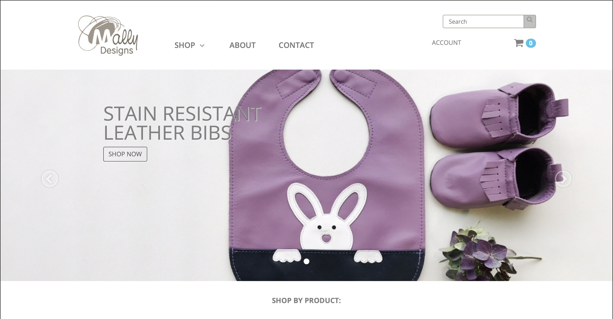
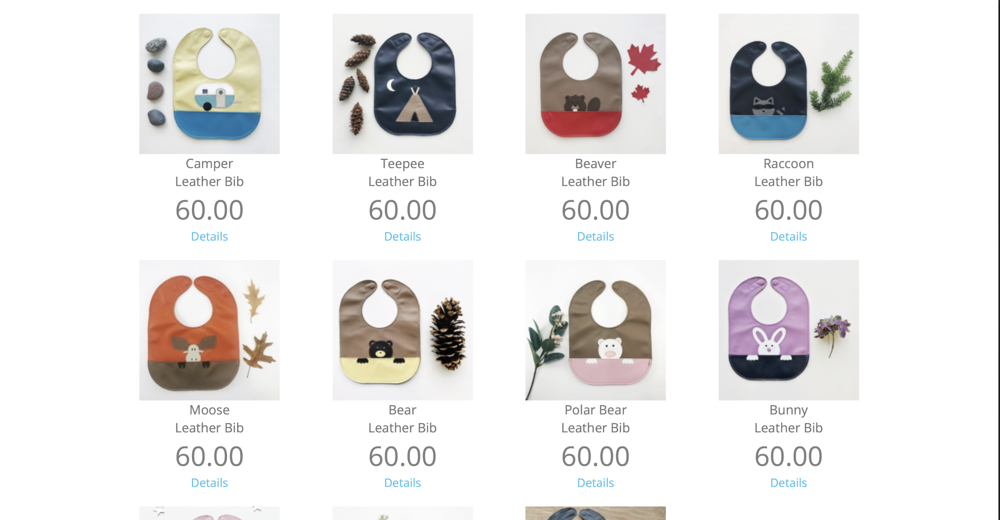
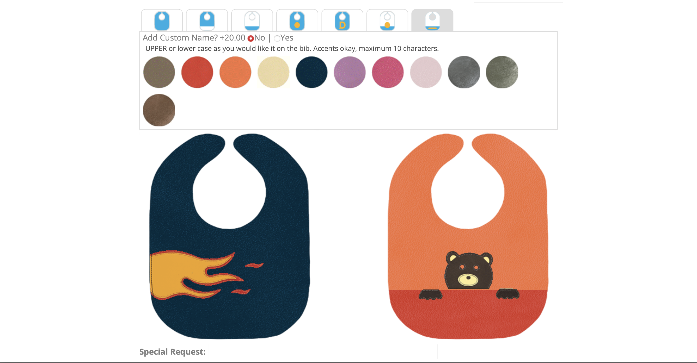

---
{
  id: "mallydesigns",
  layout: '../../../layouts/Portfolio.astro',
  scheme: "tech",
  title: "Mally Designs",
  description: "Custom eCommerce for Small Business.",
  pubDate: '2006-01-01',
  updatedDate: '2019-01-01',
  heroImage: "",
	teaserImage: "",
	bgColor: "base",
}
---

>Calvin is the only person I trust to develop my website in the most functional, efficient and cost effective way. His great service is also unmatched. I always appreciate the way he offers advice and solutions but ultimately listens to what his clients want and he makes it happen.
>
> **-- Nicole Garza, Founder Mally Designs Ltd.**

  

  

  

Mally Designs is the project that started my real career in web development. I had been doing web development for my own projects, and for a few entertainer friends, early in the 2000s, but this was my first real client. They were the first in a collection of dozens of small business clients that needed customized eCommerce solutions.

At the time, Nicole and Ron were friends of friends with a hit product on their hands and were selling online when most sites were still static HTML. They were using a "web designer" and having trouble getting timely work done on their project. Upon inspection of the site and their order processing, let's just say I found room for improvement. I was able to convince them to let me take over the site and I would build them a custom eCommerce solution that would allow them to manage their own content, orders and inventory.

## Enter Ubercart

Ubercart was an early suite of Drupal modules that allowed you to build a custom eCommerce solution. It was a great fit for Mally Designs and offered them a secure ordering process and full featured commerce. This included custom modules for integration with Moneris' Hosted Payment Page for PCI compliant payment capture. I also built them a custom theme that matched their branding and made it easy for them to update their site on their own. Over time we eventually moved to Drupal Commerce, with the upgrade to Drupal 7.

## Custom Product Studio

One extra cool feature of the site was a custom product studio that allowed customers to design their own leather baby bibs. The visual interface allowed customers to select front and back colors, front and back appliques, and even add their own text. The customizations were saved to the order and printed on the packing slip for the fulfillment team. This was a great way to allow customers to personalize their orders and was a big hit.

## A Long Relationship

I worked with Mally Designs for many years, restyling the site and adding new features as they grew. Their experience with me lead them to refer me to many of their friends from the trade shows they attended. I was able to build a small business around referrals which was a great way to get started in the web development world.
