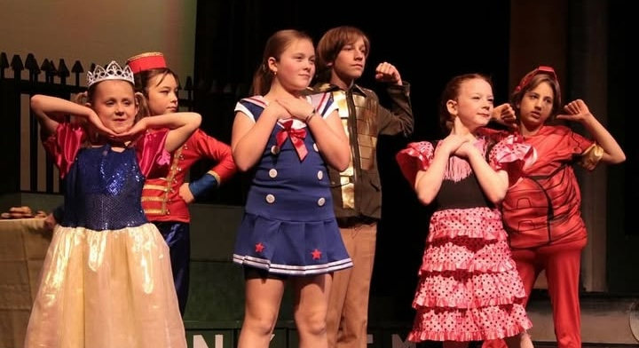
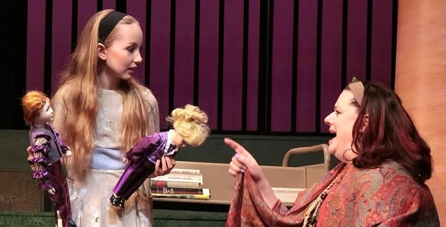
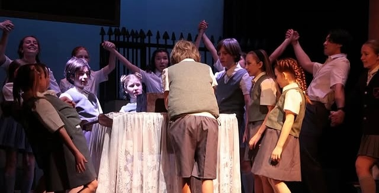
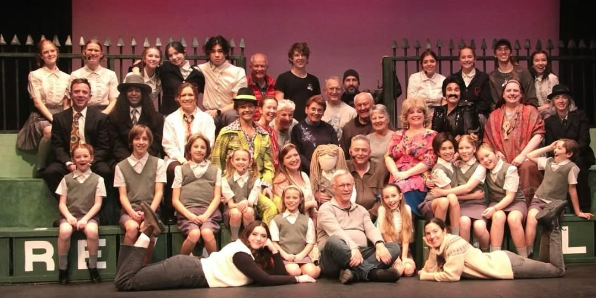

---
{
  id: "matilda",
  layout: '../../../layouts/Portfolio2.astro',
  scheme: "art",
  title: "Matilda: The Musical",
  description: "Back into theatre after all these years.",
  pubDate: '2023-10-01',
  updatedDate: '2025-05-27',
  heroImage: "bg.jpg",
	teaserImage: "bg.jpg",
	bgColor: "secondary",
}
---

  

  

  

  

  

<small>Photos: <a href="https://www.instagram.com/echoplayers/" target="_blank" ref="nofollow noopener">@echoplayers</a></small>

**Credit:** Audio: Front of House Engineer\
**Credit:** Magic Consusltant

This was the first ECHO Players production I participated in. My daughter was cast as *Bruce Bogtrotter* and as I was hanging around I managed to get asked to help out with some things.

## Audio

This production had a large cast and 21 mics. It had been a while since I operated a sound console, but it was like riding a bike and I enjoyed every show. The whole cast was wonderful and the show was a sold out success!

## Magic

There's a character known as "The Entertainer" who sings a solo in the opening number "Miracle". The Director, Brian Mather, thought it would be nice if The Entertainer, played by Mara Belbin, and her assistant, played by Julia Nixon, would rove about the audiance in the pre-show period and engage with audience members. I provided some simple magic effects and coaching on presentation.

On stage Matilda's amazing mind powers are too big to stay in her head and she uses them to move objects. I devised and built a method for telekinetically knocking over a water glass on stage.

## Summary

This was an amazing production to be a part of and I'm so proud of my daugher and the whole cast for the incredible work they did. So much talent and so much fun! It's one we will be talking about for years to come.
