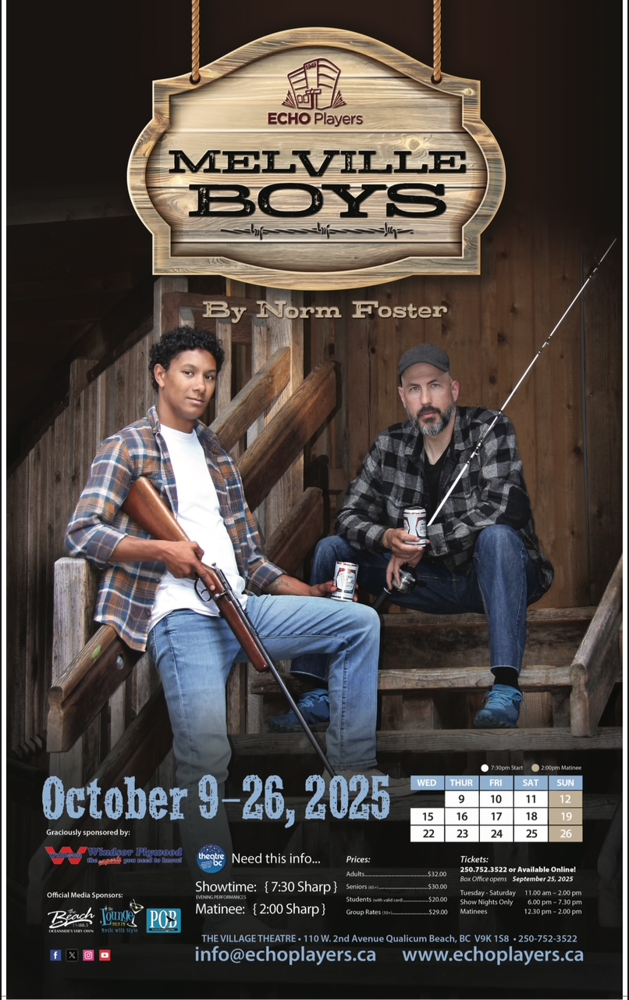
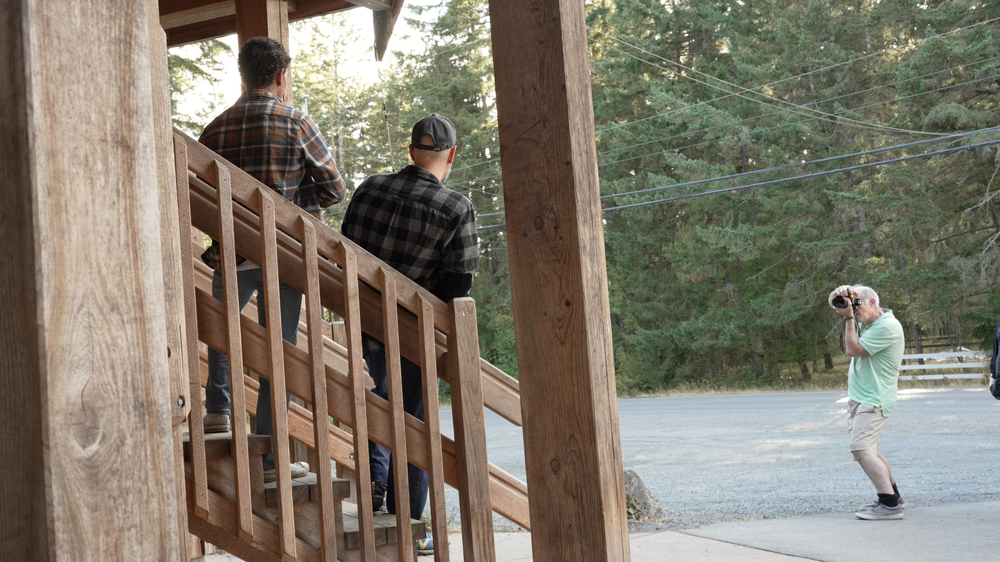
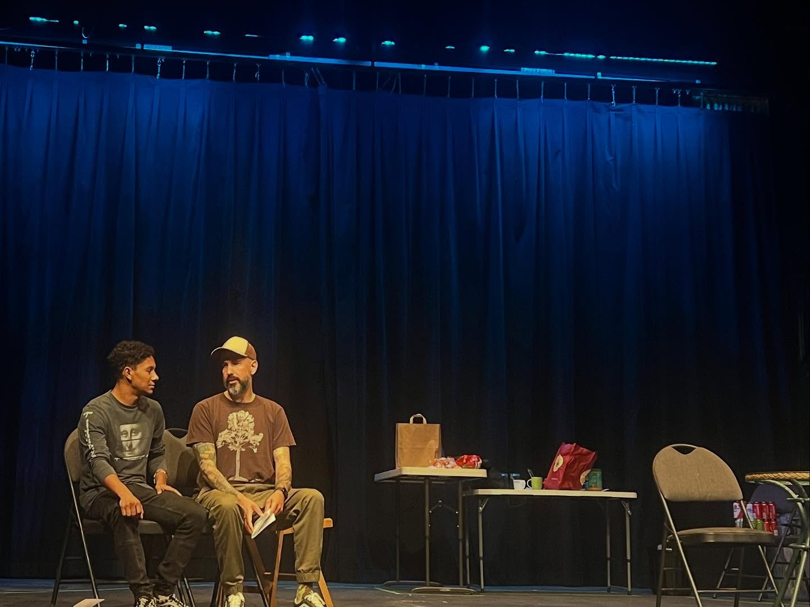
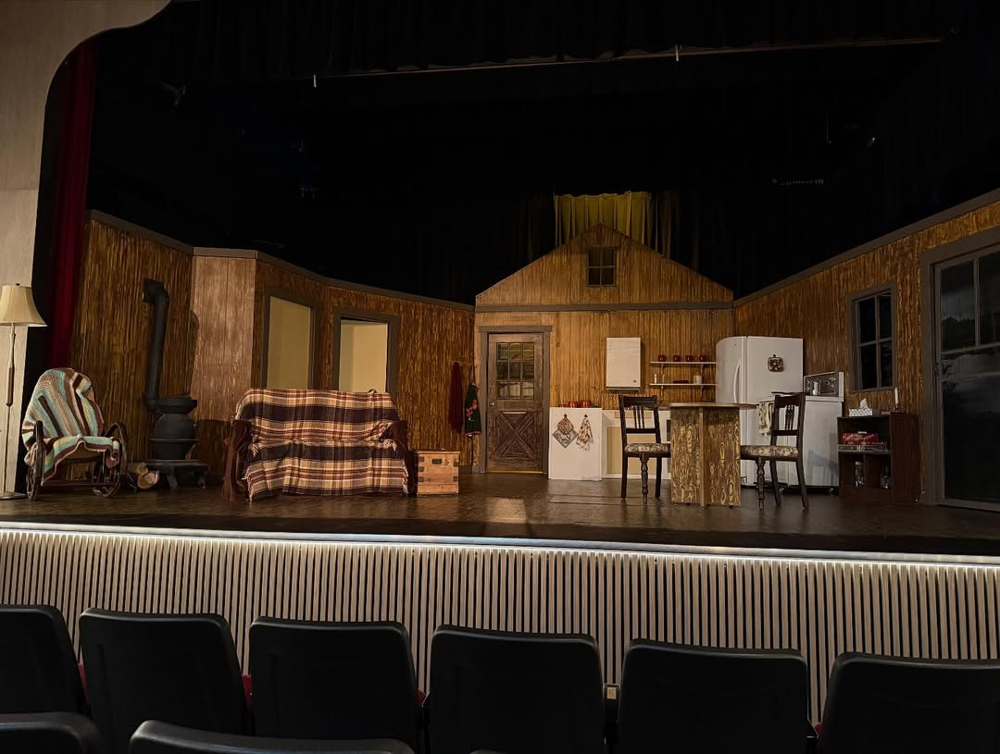
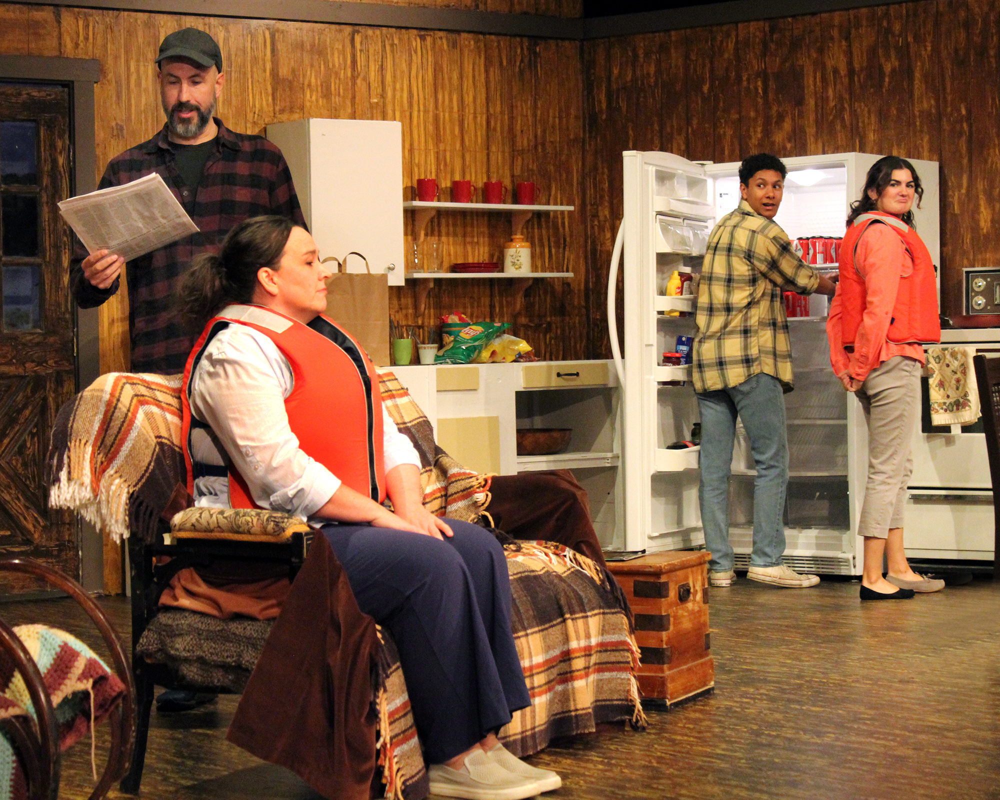

---
{
  id: "melville-boys",
  layout: '../../../layouts/Portfolio2.astro',
  scheme: "art",
  title: "The Melville Boys",
  description: "A touching comedy by Norm Foster.",
  pubDate: '2025-08-27',
  updatedDate: '2025-05-27',
  heroImage: "banner.jpg",
	teaserImage: "banner.jpg",
	bgColor: "base",
}
---

  

  

  

  

  

  

  

**Credit:** Lee\
**Run:** 9 - 26, 2025\
**PQB News Spotlight:** <a href="https://pqbnews.com/2025/10/03/spotlight-laughs-and-loyalty-in-the-melville-boys-by-echo-players/" target="_blank" rel="nofollow noopener">Read Article</a>

## A Touching Comedy by Norm Foster

Two brothers, two sisters, life and legacy. That's a lot to pack into one weekend at the lake.

I've been cast as Lee, the older brother, grappling with reality while his younger brother (Owen) tries to do anything but. I look forward to finding the balance between situational comedy and deep emotion in this role.

### Update

I can't believe it's over. We had an amazing run with sold-out shows and standing ovations. The cast and crew were fantastic, and I am so grateful to have been part of this production. I can't wait for the next one!

Speaking of the next one, watch for The Dating Game in February 2026!
