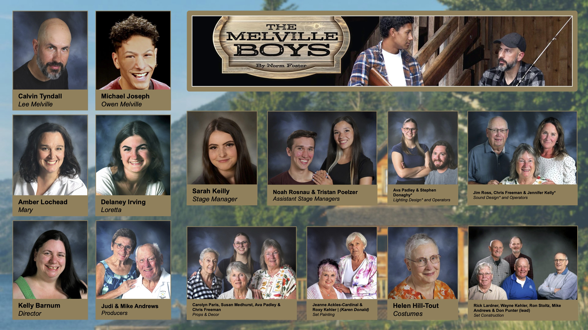

---
{
  id: "melville-boys",
  layout: '../../../layouts/Portfolio2.astro',
  scheme: "art",
  title: "The Melville Boys",
  description: "A touching comedy by Norm Foster.",
  pubDate: '2025-05-27',
  updatedDate: '2025-05-27',
  heroImage: "banner.jpg",
	teaserImage: "banner.jpg",
	bgColor: "base",
}
---

  

  

  

  

  

  

**Credit:** Lee\
**Run:** 9 - 26, 2025\
**Tickets:** <a href="https://www.echoplayers.ca/buy-tickets/the-melville-boys" target="_blank" rel="nofollow noopener">Buy Now</a>

## A Touching Comedy by Norm Foster

Two brothers, two sisters, life and legacy. That's a lot to pack into one weekend at the lake.

I've been cast as Lee, the older brother, grappling with reality while his younger brother (Owen) tries to do anything but. I look forward to finding the balance between situational comedy and deep emotion in this role.

I'm excited to work with this amazing team. Come see the show in October!

Tickets on sale NOW!

<a href="https://www.echoplayers.ca/buy-tickets/the-melville-boys" target="_blank" rel="nofollow noopener" class="button button--small button--secondary">Ticket Info</a>

