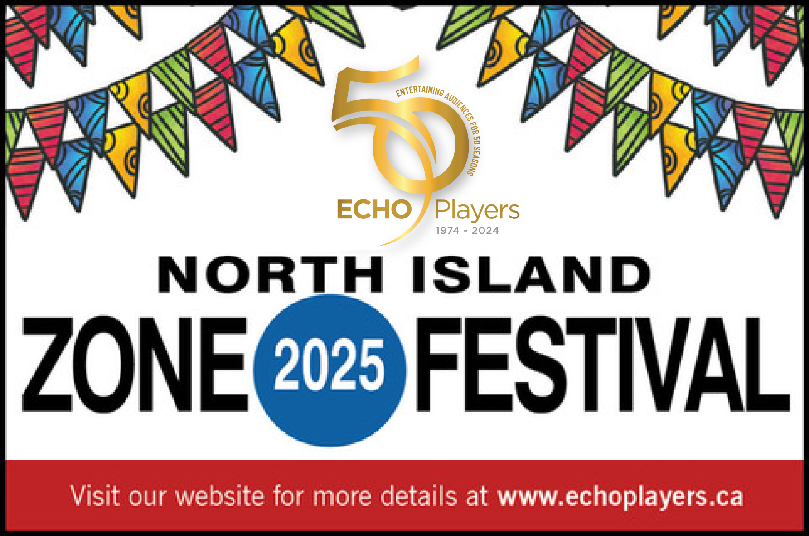
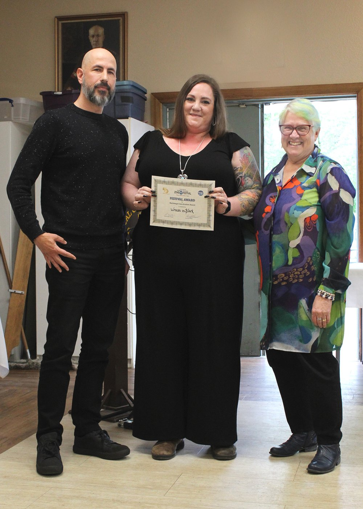
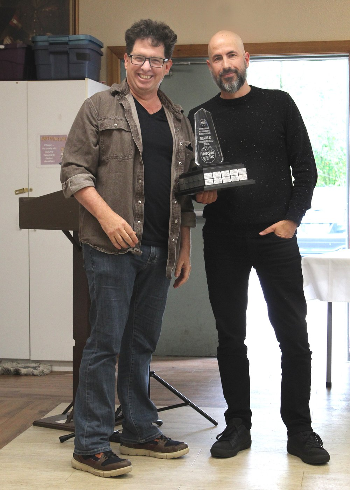

---
{
  id: "niz-festival-2025",
  layout: '../../../layouts/Portfolio2.astro',
  scheme: "art",
  title: "North Island Zone Festival 2025",
  description: "Technical Director",
  pubDate: '2025-05-02',
  updatedDate: '2025-10-01',
  heroImage: "",
	teaserImage: "",
	bgColor: "dark",
}
---

<small>Photos: <a href="https://www.instagram.com/echoplayers/" target="_blank" ref="nofollow noopener">@echoplayers</a></small>

**Credit:** Technical Director

In May 2025, I had the privilege of serving as the Technical Director for the North Island Zone Festival, hosted by ECHO Players at the Village Theatre in Qualicum, BC. This annual festival showcases a variety of theatrical productions from the North Island Zone of Vancouver Island.

As Technical Director, I was responsible for overseeing all technical aspects of the festival, including lighting, sound, etc. I made sure everyone had the information and resources they needed for a successful show. The festival featured a diverse lineup of plays, each with its own unique technical requirements.
