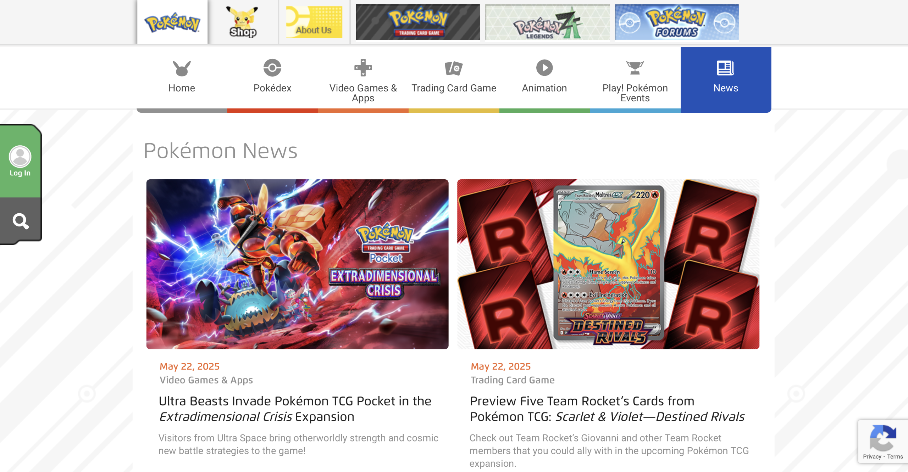

---
{
  id: "pokemon",
  layout: '../../../layouts/Portfolio.astro',
  scheme: "tech",
  title: "Pokémon",
  description: "My kids think I'm cool now.",
  pubDate: '2020-01-01',
  updatedDate: '2022-01-01',
  heroImage: "bg.png",
	teaserImage: "bg.png",
	bgColor: "accent",
}
---

  

  

  

Not only did I gain some street cred with my kids, but I also gained some really great experience with Drupal 8, early in it's lifecycle.

This project was a 1 to 1 port from another CMS. I was brought in to help get things done while another agency managed the project. I was responsible for building things backend and frontend, as well as helping the other team learn the ways of Drupal.

### Highlights

#### Drupal 8

The jump from Drupal 7 to Drupal 8 brought a change from functional programming to Symfony and OOP. I've been familiar with Object Oriented Programming for a long time with C++. I had been studying Drupal 8 and was looking forward to a fresh build with a new framework.

#### Complex Data Structures

Pokemon.com is very complex, with familiar marketing and information style content but also the Pokédex, a huge index of every Pokémon ever. The Pokédex is a complex data structure with connections between Pokémon evolutions, types, stats, weaknesses, and more. This was a great opportunity to learn about the new Entity API and how to use it effectively.

Additionally I learned about services and the new theming system. It was just a fun project to work on.

#### Migration

As this was a port from another CMS, with a lot of data to manage, Migration was a big part of the project. I dove head first into the new Migration API and learned how to use it effectively. I built some custom migration plugins to handle some requirements and helped the other team learn what I knew about it.

<a href="https://www.pokemon.com/" target="_blank" rel="nofollow noopener">pokemon.com</a>
