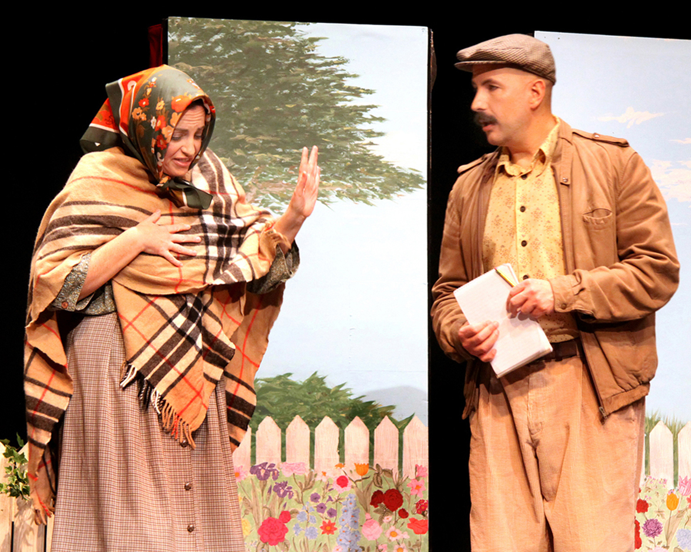
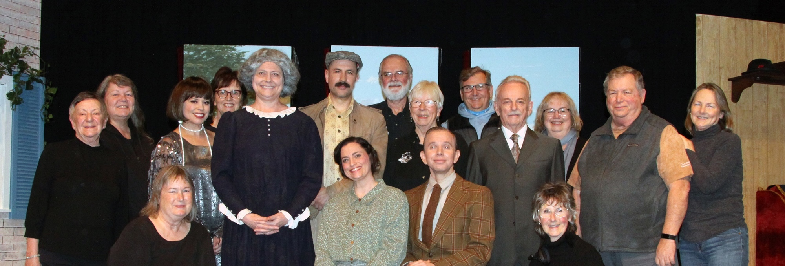
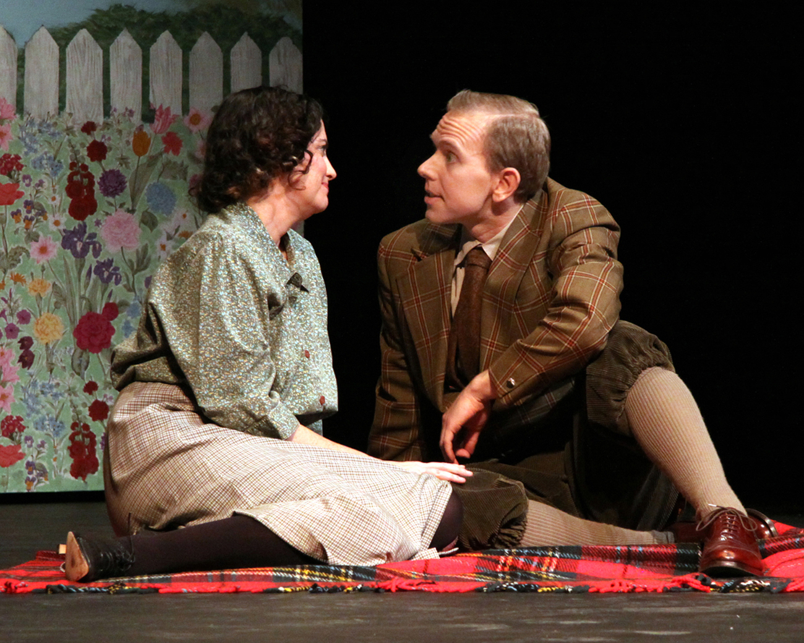

---
{
  id: "queen-milli-of-galt",
  layout: '../../../layouts/Portfolio2.astro',
  scheme: "art",
  title: "Queen Milli of Galt",
  description: "A humble role before the queen.",
  pubDate: '2023-02-03',
  updatedDate: '2025-10-02',
  heroImage: "bg.jpg",
	teaserImage: "bg.jpg",
	bgColor: "base",
}
---

  

  

  

<small>Photos: <a href="https://www.instagram.com/echoplayers/" target="_blank" ref="nofollow noopener">@echoplayers</a></small>

**Credit:** The Journalist

This was a humble role in what was essentially my first stage play. Yes I had just done a dinner theatre production, and plenty of shows as a variety performer, but this was my first time in a "real" play. It was a lot of fun, and I learned a lot about stage acting. I'm grateful to director Michael King for the opportunity to act in something a little less over the top.

I played a journalist who was there to coax the story out of Millicent Milroy (Queen Milli), who refused to talk. Based on a true life tale about a woman who claimed to be married to King Edward VIII who had spent time in Galt Ontario in 1919.

I really fell in love with being on stage and back stage with the cast and crew. I plan to do this a LOT.
