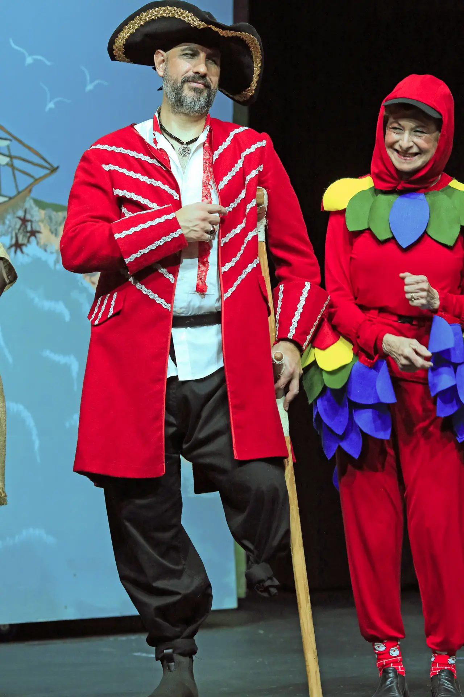
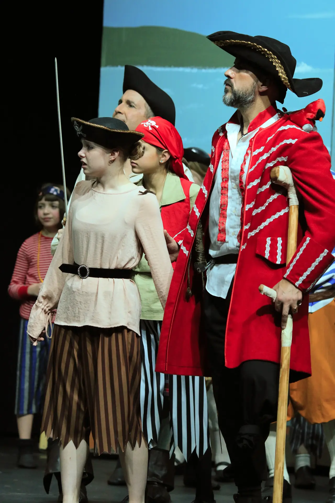
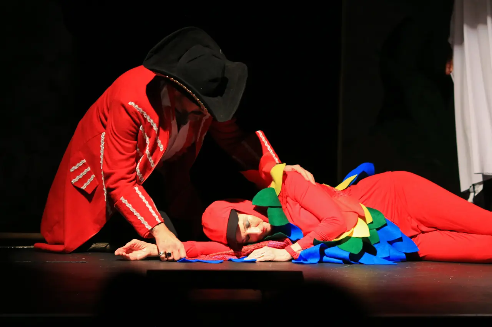

---
{
  id: "treasure-island",
  layout: '../../../layouts/Portfolio2.astro',
  scheme: "art",
  title: "Treasure Island",
  description: "Avast ye mateys!",
  pubDate: '2024-12-02',
  updatedDate: '2025-10-02',
  heroImage: "bg.jpg",
	teaserImage: "card.jpg",
	bgColor: "dark",
}
---

  

  

  

  

  

  

  

<small>Photos: <a href="https://www.instagram.com/echoplayers/" target="_blank" ref="nofollow noopener">@echoplayers</a></small>

**Credit:** Long John Silver

Directed by Julian Packer. What a fun and crazy production this was! I could have gone the easy route and taken the option to just paint a knee high sock as a wooden leg, but where's the fun in that? Instead I suggested the foolish idea of tying my leg up and hopping around with a makeshift crutch. It looked convincing but was exhausting! The astute members of the audience may have noticed that ol' Long John's missing leg magically switched sides after intermission. If you're going to do a leg work out, you should work both sides evenly, right?

This was a huge production with much singing and frivolity. Let's see if next years panto can top it!
