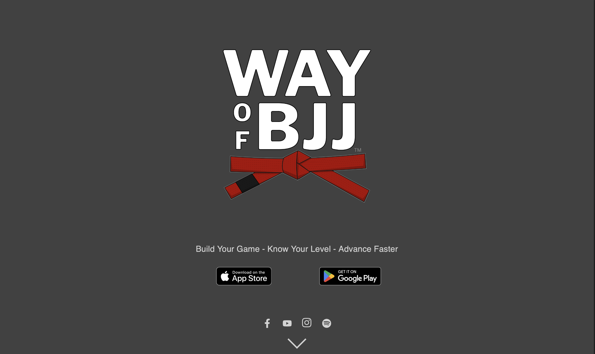
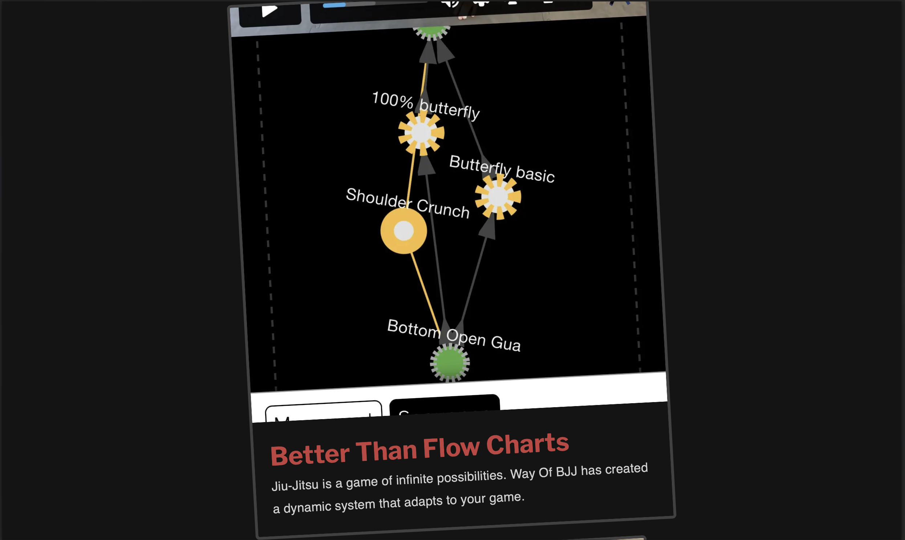

---
{
  id: wayofbjj,
  layout: '../../../layouts/Portfolio.astro',
  scheme: "tech",
  title: "Way Of BJJ",
  description: "Think like a black belt.",
  pubDate: '2024-07-23',
  updatedDate: '2024-07-23',
  heroImage: "bg.jpg",
	teaserImage: "bg.jpg",
	bgColor: "dark",
}
---

  

  

WayOfBJJ is a JiuJitsu Training App for iOS and Android, offering subscription based content and tools to customize your training and accelerate your skill development.

Jiu Jitsu is not a straightforward martial art like Karate or Tae Kwon Do, where you learn a kata and some strikes to pass your next belt test.  Jiu Jitsu is a complex and completely organic form of martial arts and everyone's "game" is different based on anything from body type to personal preference.

I worked with my founding partners for 2 years to understand and translate their Jiu Jitsu knowledge into a flexible system that captures their teaching and coaching methods, making it easier for students to understand the structure of jiu jitsu and find their fastest way foward in the art.

## Highlights
 - Some secret sauce.
 - Custom Skill Trees to understand your game.
 - Unique content format to focus your training.
 - Video Production of instructor content.
 - Instructor revenue share.
 - Many more features to come.

<a href="https://wayof.app" target="_blank" rel="noopener noreferrer">Check it out!</a>
