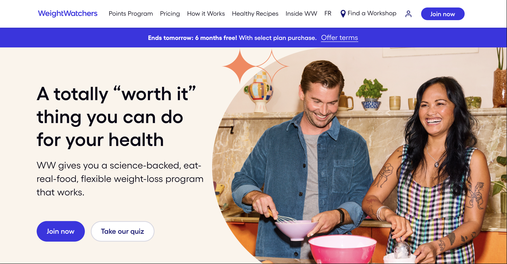
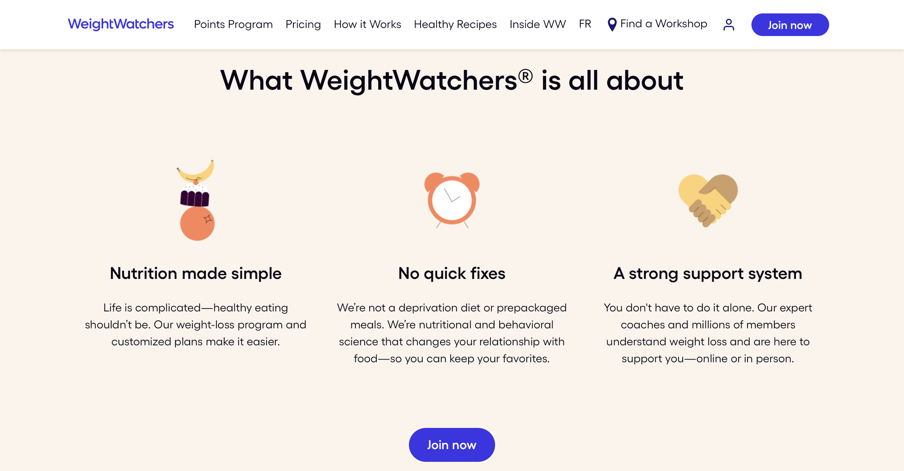
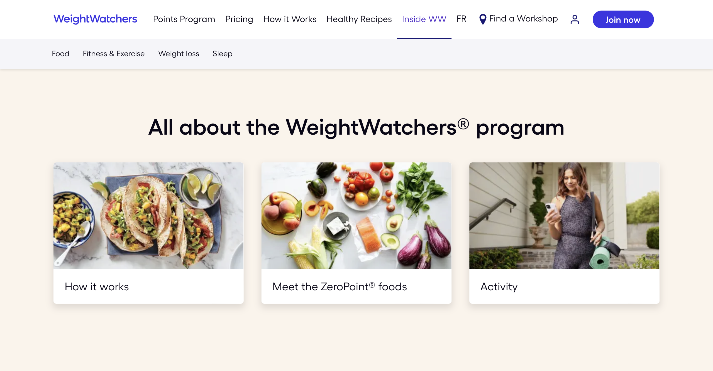

---
{
  id: "weightwatchers",
  layout: '../../../layouts/Portfolio.astro',
  scheme: "tech",
  title: "Weight Watchers",
  description: "Leveling Up.",
  pubDate: '2019-01-01',
  updatedDate: '2019-01-01',
  heroImage: "",
	teaserImage: "",
	bgColor: "base",
}
---

> Calvin is the single greatest non-Phase2 developer I've worked with in the last 5 years. — **Chris Bloom (Director of Engineering, Frontend - Phase2)**

  

  

  

When I finally joined the land of agencies, Weight Watchers was my first project. Phase2 brought me in to help kick start things as they waited for their internal team to roll off of other projects. I was lucky enough to have the first commits to the repo, and also the most commits by a fair margin, by the time I rolled off the project 2 years later. My initial contract was only 6 months, but they found me valuable enough to keep extending it. I'm eternally grateful to have learned so much from that team.

This was a brand new build from scratch, not a port from another site. Coming from a background of solo development for my small business clients, I had the Drupal chops, but no experience with a large team. I'll say this was the most valuable experience of my career. Not only did I learn about Agile development with a team, I soaked up everything I could about every role on the project, from managing the project to managing the code.

The team was very open and collaborative and I can't say enough about how much I valued the experience. I also learned how advanced my skills actually were. Working on my own and being a self taught coder from such a young age, I had a versatility that made me indispensable on the team.

>I would absolutely recommend you to another project for many and varied reasons:
> - Your analytical skills.
> - Your versatility in tackling back end and front end development and solutions to issues.
> - Your Drupal knowledge is exemplary.
> - Your development skills and knowledge of development tools is excellent.
> - You are independent, engaged, and curious.
> - You are a fantastic teammate, and I would always want you on my team.
> - Your desire to improve and become even better at what you do."
>
> -- **Ray Stuart (Senior Developer - Better Workdays formerly at Phase2)**

### Highlights

#### Frontend

I really leveled up my front end skills on this project. All the Phase2 developers are highly skilled and I learned a lot from Chris Bloom and Chris Clark who were front end focused for weightwatchers.com. More than that I was seeing how teams could push each other forward by bringing new ideas to the table and working together to set a new standard. I saw this happening constantly at Phase2, not just on the front end.

I was introduced to the concept of "slices" on the front end, or building up a page by stacking up components on the page. This was a big shift from thinking about designing a "web page" with regions and blocks, to something you could compose from sections of content. This went even deeper with the introduction of <a href="https://atomicdesign.bradfrost.com/table-of-contents/" target="_blank" ref="noopener nofollow">Atomic Design</a>. The team was encouraged to read the book by Brad Frost and I took it to heart.

### Recursive Cloning

There's a module in Drupal called "Paragraphs". It's a bit of a misnomer, as it really allows you to create complex data structures with nested fields. This is a great way to build up a page with components and our front end "slices" could be built with Paragraphs in the editor experience.

The editorial team requested the ability to clone Drupal "Nodes" to avoid needing to rebuild similar page structures over and over again, or to copy nodes from a staging site to a production site without having to sync databases. In a multilingual site, the data structure can get very complex. Starting with the node as the top level entity, composed of Paragraphs (which are also entities), and then each Paragraph can have fields that reference entities, and so on.

Then we had to consider that there can be up to 13 (at the time) versions of a node translated into different languages. In order to clone a node to another site, we needed a custom module that was able to recurisvly traverse all fields/entities that made up a node, and then reproduce that structure in the target location. Using a REST API, I was able to achieve the disired functionality.

The module could even detect compatible languages and only clone languages that were enabled on the target site and fall back to the default language if no compatible language was found.

This was a fun little back end challenge.
